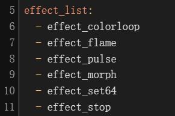

# LIFX component remix

Welcome to the `lifx_joy` remix repository!

This repo is a remix of [`Djelibeybi/aiolifx-themes`][1] and [`frawau/aiolifx`][2], with addtional features and improvements.

## Features
Added stationary theme support for matrix LIFX devices in Home Assistant.

- **New Matrix Effects**: Added new effects [`Set64`][3] for matrix LIFX devices (candles and tiles).
- **New Service**: Added new service `LIFX JOY: effect_set64` for matrix LIFX devices (candles and tiles).

## Screenshot

## Installation
To get started with this remix, you can download the repository:
- Copy `lifx_joy` folder to your `custom_components` folder
- Restart Home Assistant
- Add `lifx_joy` from integration

## Utils
- Generate palette from picture using `pic2palette.py`

## Known issues
- Only tested on Candle (Tiles should works too)

[1]: https://github.com/Djelibeybi/aiolifx-themes
[2]: https://github.com/frawau/aiolifx
[3]: https://lan.developer.lifx.com/docs/changing-a-device#set64---packet-715

